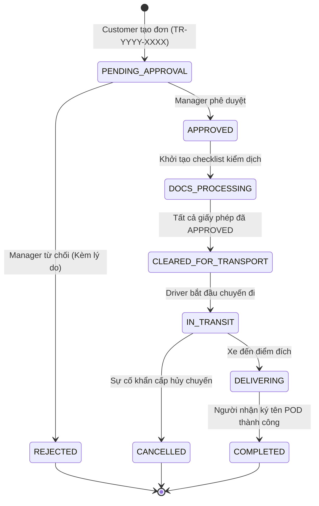
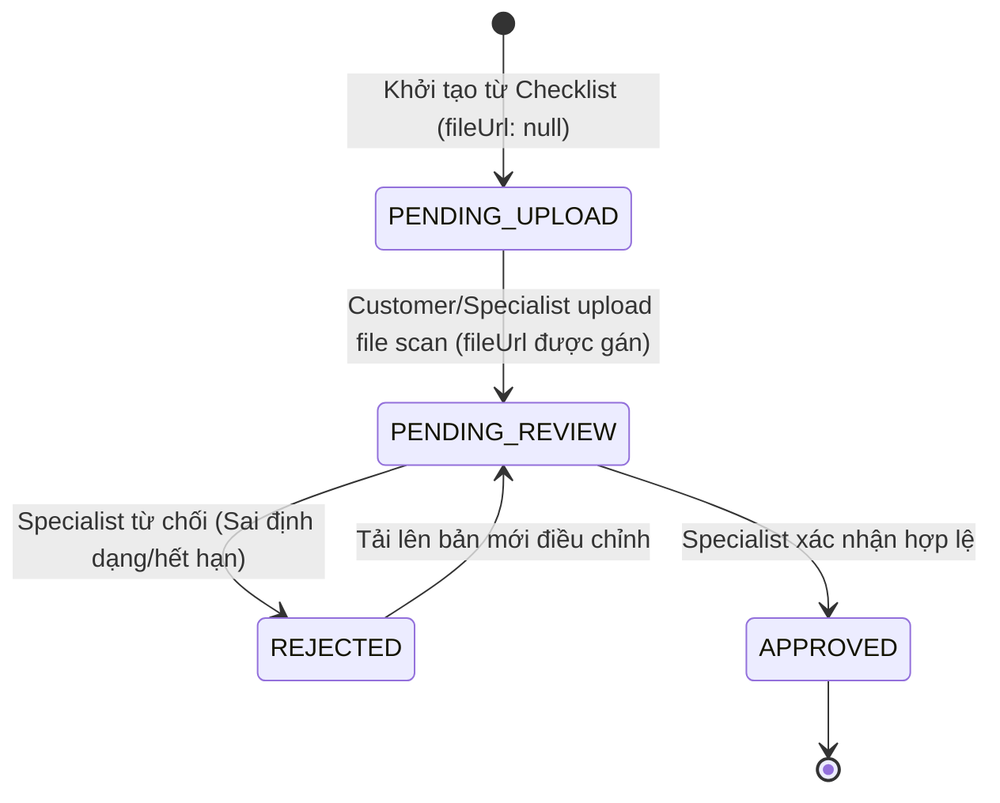
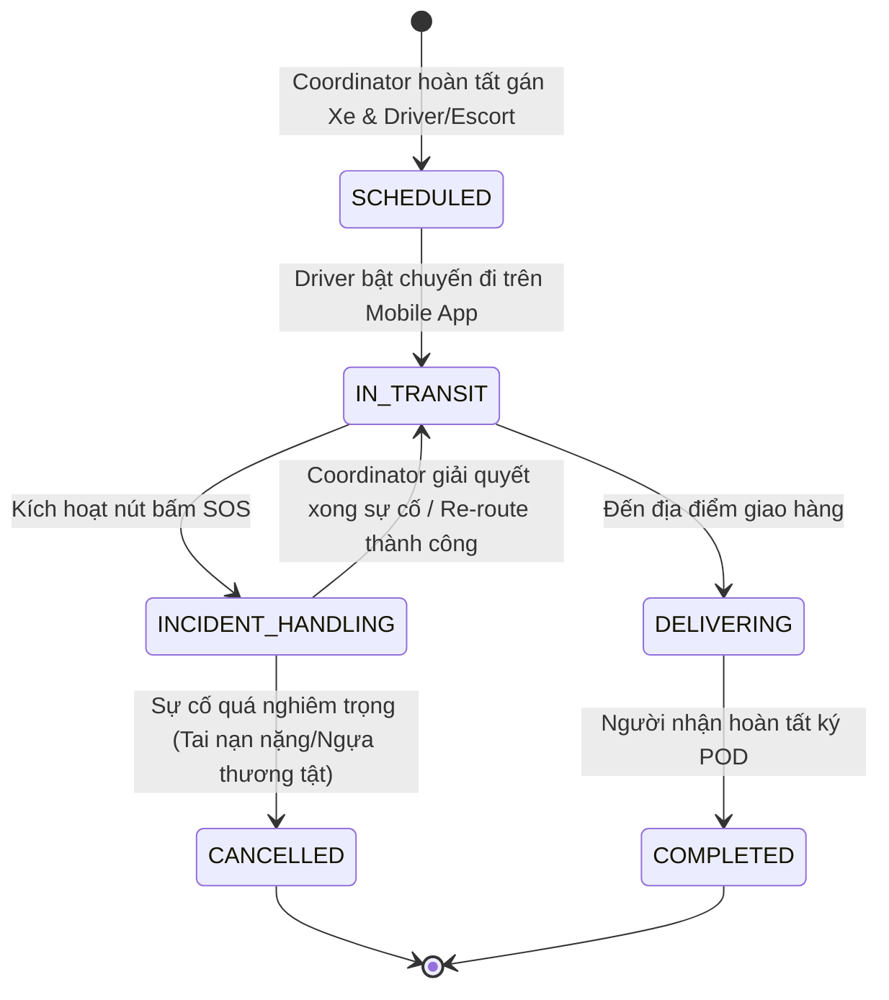
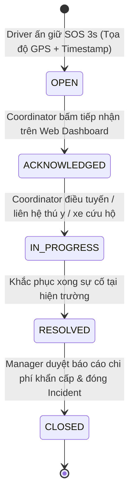

# HỆ THỐNG QUẢN LÝ VẬN CHUYỂN NGỰA ĐUA XUYÊN QUỐC GIA (CBRT)
## MASTER SPECIFICATION & TECHNICAL ARCHITECTURE (V1.0 - REFINED & LOCKED)

> **Trạng thái:** BẢN VIỄN CẢNH KỸ THUẬT NGHỆ THUẬT (REFINED MASTER SPECIFICATION V1.0)  
> **Áp dụng cho:** AI Coding Assistant (Antigravity), Backend ExpressJS Team, Frontend ReactJS Team, Mobile React Native Team.  
> **Quy tắc:** Đã được rà soát 10 điểm kiến trúc chuyên sâu. Không tự ý sửa đổi khi chưa cập nhật tài liệu này.

---

## 1. KHÓA CHẶT PHẠM VI HỆ THỐNG V1.0 (LOCKED SCOPE V1.0)

### 1.1 In-Scope (Bắt buộc hoàn thành trong V1.0)
1. **Xác thực & Phân quyền Hạt mịn (Auth & Granular RBAC):** Đăng nhập JWT (Access Token sống ngắn + Session Refresh Token có thể Revoke từng thiết bị), phân quyền dựa trên Permission Strings.
2. **Số hóa Lý lịch & Hộ chiếu Ngựa (Horse Profile):** Quản lý Microchip ID (ISO 11784/11785), FEI Passport, thông tin sinh học và tiền sử y tế.
3. **Quản lý Đặt đơn & Xét duyệt (Booking Management):** Khách hàng tạo đơn `TR-YYYY-XXXX`, Quản lý điều hành phê duyệt/từ chối.
4. **Kiểm dịch & Giấy phép Hải quan (Compliance Engine):** Gợi ý checklist tài liệu theo tuyến đường (Quốc gia Đi / Quá cảnh / Đến), tải hồ sơ số hóa, kiểm duyệt và phát hành `CLEARED_FOR_TRANSPORT`.
5. **Điều phối & Lập kế hoạch Lộ trình (Dispatch & Fleet Routing):** Chọn phương tiện phù hợp, xây dựng Waypoints, phân công Tài xế (Driver) & Chuyên viên chăm sóc (Escort).
6. **Giám sát GPS Real-time & Cảnh báo Lệch tuyến (Geofence & Deviation Alert):** Đẩy tọa độ GPS chạy ngầm từ Mobile qua Socket.io về Web Dashboard; tự động phát hiện và gửi cảnh báo khi xe chạy lệch tuyến $> 2\text{ km}$ hoặc dừng bất thường $> 30\text{ phút}$.
7. **Nhật ký Sức khỏe Ngựa (Welfare Logging):** Escort ghi nhận thông số y tế (nhiệt độ, nước, thức ăn, mức độ căng thẳng) và ảnh thực tế mỗi 2–4 giờ.
8. **Báo động SOS Khẩn cấp & Xử lý Sự cố (SOS Emergency Response):** Nhấn giữ 3 giây trên Mobile, phát tín hiệu còi/đèn đỏ trên Web Admin, hỗ trợ Coordinator định vị bệnh viện thú y và Re-routing hoặc Hủy chuyến khẩn cấp.
9. **Nghiệm thu Bàn giao Điện tử (Digital POD):** Cho phép Customer hoặc Người nhận ủy quyền (Authorized Recipient / Stable Manager) ký tên cảm ứng, lưu Audit context (Tên, SĐT, Vai trò, GPS, Timestamp, Signature Image) và xuất file PDF.
10. **Đồng bộ Mất mạng (Offline-First Sync Engine):** Lưu các sự kiện nghiệp vụ quan trọng (`WAYPOINT_CHECKIN`, `HEALTH_LOG`, `SOS_TRIGGER`, `POD_SIGN`) vào SQLite, tự động đồng bộ về Server khi có mạng với cơ chế **Idempotency Key (`event_id` UUID)**. (Lưu ý: Tọa độ GPS định kỳ được giảm tần suất lưu sampling/breadcrumb khi offline để tránh nghẽn SQLite/DB).
11. **Nhật ký Truy vết Hệ thống (Audit Log System):** Ghi vết toàn bộ thao tác với trạng thái kết quả (`SUCCESS`, `FAILURE`, `DENIED`).
12. **Báo cáo KPI & Đối soát Hóa đơn B2B (B2B Billing Reconciliation):** Thống kê OTD %, tổng Km, số vụ SOS và xuất báo cáo đối soát hóa đơn B2B (Không thanh toán gateway v1.0).

### 1.2 Out-of-Scope (Không triển khai trong V1.0)
- Tích hợp cổng thanh toán trực tuyến tự động (VNPay/Stripe/Visa).
- Đặt vé máy bay trực tiếp qua API đại lý hàng không.
- Đọc dữ liệu tự động từ phần cứng cảm biến BLE/IoT trực tiếp (chỉ chuẩn bị data model).

---

## 2. MA TRẬN PHÂN QUYỀN HẠT MỊN (ROLES & PERMISSIONS MATRIX)

### 2.1 Danh sách 6 Vai trò (Roles)
* `LOGISTICS_MANAGER` (Quản lý Điều hành Vận chuyển)
* `TRANSPORT_SPECIALIST` (Chuyên viên Pháp lý & Kiểm dịch)
* `FLEET_COORDINATOR` (Điều phối viên Đội xe & Lộ trình)
* `DRIVER` (Tài xế Xe chuyên dụng)
* `ESCORT` (Chuyên viên Chăm sóc Ngựa đi kèm)
* `CUSTOMER` (Khách hàng - Chủ Ngựa / Câu lạc bộ Đua)

### 2.2 Bảng Ánh xạ Permission Strings

| Permission String | Tên Quyền Nghiệp Vụ | Manager | Specialist | Coordinator | Driver | Escort | Customer |
| :--- | :--- | :---: | :---: | :---: | :---: | :---: | :---: |
| `user:manage` | Quản lý người dùng & phân quyền | ✅ | ❌ | ❌ | ❌ | ❌ | ❌ |
| `horse:create_own` | Đăng ký hồ sơ ngựa cá nhân | ❌ | ❌ | ❌ | ❌ | ❌ | ✅ |
| `horse:manage_all` | Quản lý & duyệt tất cả hồ sơ ngựa | ✅ | ✅ | ❌ | ❌ | ❌ | ❌ |
| `booking:create` | Tạo đơn vận chuyển mới | ❌ | ❌ | ❌ | ❌ | ❌ | ✅ |
| `booking:approve` | Phê duyệt hoặc từ chối đơn đặt hàng | ✅ | ❌ | ❌ | ❌ | ❌ | ❌ |
| `compliance:review` | Kiểm duyệt chứng chỉ & giấy phép thông quan | ❌ | ✅ | ❌ | ❌ | ❌ | ❌ |
| `compliance:upload` | Tải lên tài liệu y tế / tiêm phòng | ❌ | ✅ | ❌ | ❌ | ❌ | ✅ |
| `route:dispatch` | Lập lộ trình, gán xe & phân công nhân sự | ❌ | ❌ | ✅ | ❌ | ❌ | ❌ |
| `trip:start` | Khởi hành chuyến đi (`IN_TRANSIT`) | ❌ | ❌ | ❌ | ✅ | ❌ | ❌ |
| `trip:operate` | Thực hiện thao tác nghiệp vụ trên đường | ❌ | ❌ | ❌ | ✅ | ✅ | ❌ |
| `waypoint:checkin` | Check-in mốc di chuyển tại các trạm | ❌ | ❌ | ❌ | ✅ | ✅ | ❌ |
| `welfare:log` | Ghi nhật ký sức khỏe & chụp ảnh ngựa | ❌ | ❌ | ❌ | ❌ | ✅ | ❌ |
| `sos:trigger` | Khởi tạo báo động khẩn cấp SOS | ❌ | ❌ | ❌ | ✅ | ✅ | ❌ |
| `sos:manage` | Tiếp nhận, điều tuyến & xử lý sự cố SOS | ✅ | ❌ | ✅ | ❌ | ❌ | ❌ |
| `pod:sign` | Ký tên xác nhận bàn giao nghiệm thu | ❌ | ❌ | ❌ | ❌ | ❌ | ✅ |
| `sync:offline_events` | Gửi dữ liệu offline từ thiết bị Mobile | ❌ | ❌ | ❌ | ✅ | ✅ | ❌ |
| `audit:view` | Xem nhật ký truy vết hệ thống | ✅ | ❌ | ❌ | ❌ | ❌ | ❌ |
| `analytics:view` | Xem báo cáo KPI kinh doanh & vận hành | ✅ | ❌ | ✅ | ❌ | ❌ | ❌ |

---

## 3. CHUẨN HÓA SƠ ĐỒ TRẠNG THÁI (COMPLETE STATE MACHINES)

### 3.1 State Machine Đơn Vận Chuyển (`Order / Booking`)



### 3.2 State Machine Tài liệu Kiểm dịch (`Compliance Document`)



### 3.3 State Machine Chuyến Vận Chuyển (`Transport Route / Trip`)



### 3.4 State Machine Xử lý Sự cố Khẩn cấp (`SOS Incident`)



---

## 4. DESIGN CƠ SỞ DỮ LIỆU & MONGOOSE DATA MODELS

### 4.1 Mongoose Schemas Chi Tiết

#### 1. `User` Schema & `RefreshTokenSession` Schema
```javascript
const userSchema = new mongoose.Schema({
  username: { type: String, required: true, unique: true, index: true },
  email: { type: String, required: true, unique: true },
  password: { type: String, required: true }, // Hash Bcrypt
  fullName: { type: String, required: true },
  phone: { type: String, required: true },
  role: { 
    type: String, 
    enum: ['LOGISTICS_MANAGER', 'TRANSPORT_SPECIALIST', 'FLEET_COORDINATOR', 'DRIVER', 'ESCORT', 'CUSTOMER'],
    required: true 
  },
  permissions: [{ type: String }],
  isActive: { type: Boolean, default: true }
}, { timestamps: true });

// Schema riêng cho Session Refresh Token (hỗ trợ Logout/Revoke từng thiết bị)
const refreshTokenSessionSchema = new mongoose.Schema({
  userId: { type: mongoose.Schema.Types.ObjectId, ref: 'User', required: true, index: true },
  refreshTokenHash: { type: String, required: true, index: true },
  deviceName: { type: String },
  ipAddress: { type: String },
  expiresAt: { type: Date, required: true },
  isRevoked: { type: Boolean, default: false }
}, { timestamps: true });
```

#### 2. `Horse` Schema (Linh hoạt Validation Microchip)
```javascript
const horseSchema = new mongoose.Schema({
  microchipId: { 
    type: String, 
    required: true, 
    unique: true, 
    index: true,
    validate: {
      validator: function(v) {
        return /^[A-Za-z0-9]{10,18}$/.test(v); // Linh hoạt chuẩn ISO 11784/11785 (thường là 15 chữ số)
      },
      message: props => `${props.value} không phải là Mã Chip hợp lệ!`
    }
  },
  feiPassportNumber: { type: String, required: true, unique: true },
  name: { type: String, required: true },
  breed: { type: String, required: true },
  dateOfBirth: { type: Date, required: true },
  gender: { type: String, enum: ['STALLION', 'MARE', 'GELDING'], required: true },
  weightKg: { type: Number, required: true },
  ownerId: { type: mongoose.Schema.Types.ObjectId, ref: 'User', required: true },
  passportScanUrl: { type: String, required: true },
  photos: [{ type: String }],
  medicalHistoryNotes: { type: String }
}, { timestamps: true });
```

#### 3. `Order` (Booking) Schema
```javascript
const orderSchema = new mongoose.Schema({
  bookingCode: { type: String, required: true, unique: true, index: true }, // Format: TR-YYYY-XXXX
  customerId: { type: mongoose.Schema.Types.ObjectId, ref: 'User', required: true },
  horseIds: [{ type: mongoose.Schema.Types.ObjectId, ref: 'Horse', required: true }],
  origin: {
    address: { type: String, required: true },
    countryCode: { type: String, required: true },
    coordinates: { type: [Number], required: true } // [lng, lat]
  },
  destination: {
    address: { type: String, required: true },
    countryCode: { type: String, required: true },
    coordinates: { type: [Number], required: true } // [lng, lat]
  },
  requestedDepartureDate: { type: Date, required: true },
  specialRequirements: { type: String },
  status: {
    type: String,
    enum: ['PENDING_APPROVAL', 'APPROVED', 'REJECTED', 'DOCS_PROCESSING', 'CLEARED_FOR_TRANSPORT', 'IN_TRANSIT', 'DELIVERING', 'COMPLETED', 'CANCELLED'],
    default: 'PENDING_APPROVAL',
    index: true
  },
  rejectionReason: { type: String }
}, { timestamps: true });
```

#### 4. `ComplianceDoc` Schema (Tải dần - `fileUrl` không bắt buộc ở `PENDING_UPLOAD`)
```javascript
const complianceDocSchema = new mongoose.Schema({
  orderId: { type: mongoose.Schema.Types.ObjectId, ref: 'Order', required: true, index: true },
  horseId: { type: mongoose.Schema.Types.ObjectId, ref: 'Horse' },
  documentType: { type: String, required: true }, // COGGINS_TEST, EQUINE_INFLUENZA, EXPORT_PERMIT, IMPORT_PERMIT
  countryCode: { type: String, required: true },
  fileUrl: { type: String, required: false, default: null }, // Null khi ở trạng thái PENDING_UPLOAD
  expiresAt: { type: Date },
  status: {
    type: String,
    enum: ['PENDING_UPLOAD', 'PENDING_REVIEW', 'APPROVED', 'REJECTED'],
    default: 'PENDING_UPLOAD'
  },
  verifiedBy: { type: mongoose.Schema.Types.ObjectId, ref: 'User' },
  rejectionReason: { type: String }
}, { timestamps: true });
```

#### 5. `TransportRoute` (Trip) Schema (Mặc định `currentLocation` = `null` & Cảnh báo Lệch tuyến)
```javascript
const transportRouteSchema = new mongoose.Schema({
  orderId: { type: mongoose.Schema.Types.ObjectId, ref: 'Order', required: true, unique: true },
  vehiclePlateNumber: { type: String, required: true },
  driverId: { type: mongoose.Schema.Types.ObjectId, ref: 'User', required: true },
  escortId: { type: mongoose.Schema.Types.ObjectId, ref: 'User', required: true },
  waypoints: [{
    sequence: { type: Number, required: true },
    name: { type: String, required: true },
    type: { type: String, enum: ['PICKUP', 'REST_STOP', 'BORDER_CUSTOMS', 'VET_CHECK', 'DELIVERY'], required: true },
    location: {
      type: { type: String, default: 'Point' },
      coordinates: { type: [Number], required: true } // [lng, lat]
    },
    estimatedArrival: { type: Date, required: true },
    actualArrival: { type: Date },
    status: { type: String, enum: ['PENDING', 'ARRIVED', 'SKIPPED'], default: 'PENDING' }
  }],
  // Mặc định null trước khi có bản tin GPS đầu tiên
  currentLocation: {
    type: {
      type: { type: String, default: 'Point' },
      coordinates: { type: [Number] }, // [lng, lat]
      speedKmh: { type: Number },
      headingDegree: { type: Number },
      updatedAt: { type: Date }
    },
    default: null
  },
  // Lưu danh sách cảnh báo lệch tuyến / dừng bất thường
  routeDeviations: [{
    detectedAt: { type: Date, default: Date.now },
    location: { type: [Number] }, // [lng, lat]
    deviationDistanceKm: { type: Number },
    type: { type: String, enum: ['ROUTE_DEVIATION', 'UNSCHEDULED_LONG_STOP'], required: true },
    status: { type: String, enum: ['OPEN', 'ACKNOWLEDGED', 'RESOLVED'], default: 'OPEN' },
    acknowledgedBy: { type: mongoose.Schema.Types.ObjectId, ref: 'User' }
  }],
  status: {
    type: String,
    enum: ['SCHEDULED', 'IN_TRANSIT', 'INCIDENT_HANDLING', 'DELIVERING', 'COMPLETED', 'CANCELLED'],
    default: 'SCHEDULED',
    index: true
  }
}, { timestamps: true });
transportRouteSchema.index({ "currentLocation.coordinates": "2dsphere" });
```

#### 6. `HealthLog` Schema
```javascript
const healthLogSchema = new mongoose.Schema({
  eventId: { type: String, required: true, unique: true, index: true }, // UUID v4
  tripId: { type: mongoose.Schema.Types.ObjectId, ref: 'TransportRoute', required: true, index: true },
  horseId: { type: mongoose.Schema.Types.ObjectId, ref: 'Horse', required: true },
  recordedBy: { type: mongoose.Schema.Types.ObjectId, ref: 'User', required: true },
  temperatureCelsius: { type: Number, required: true },
  waterIntakeLiters: { type: Number, required: true },
  foodIntakeStatus: { type: String, required: true },
  condition: { type: String, enum: ['STABLE', 'STRESSED', 'UNSTABLE'], required: true },
  alertType: { type: String, enum: ['NONE', 'FEVER', 'INJURED', 'DEHYDRATION'], default: 'NONE' },
  photoUrl: { type: String },
  notes: { type: String },
  recordedAt: { type: Date, required: true }
}, { timestamps: true });
```

#### 7. `DigitalPOD` Schema (Hỗ trợ Người nhận Ủy quyền)
```javascript
const digitalPODSchema = new mongoose.Schema({
  tripId: { type: mongoose.Schema.Types.ObjectId, ref: 'TransportRoute', required: true, unique: true },
  orderId: { type: mongoose.Schema.Types.ObjectId, ref: 'Order', required: true },
  signerName: { type: String, required: true },
  signerPhone: { type: String, required: true },
  signerRole: { 
    type: String, 
    enum: ['CUSTOMER', 'AUTHORIZED_RECIPIENT', 'STABLE_MANAGER', 'VETERINARIAN'], 
    required: true 
  },
  signatureImageUrl: { type: String, required: true },
  locationSigned: {
    type: { type: String, default: 'Point' },
    coordinates: { type: [Number], required: true } // [lng, lat]
  },
  horseConditionsOnArrival: [{
    horseId: { type: mongoose.Schema.Types.ObjectId, ref: 'Horse', required: true },
    conditionStatus: { type: String, enum: ['EXCELLENT', 'GOOD', 'MINOR_STRESS', 'INJURED'], required: true },
    notes: { type: String }
  }],
  pdfReportUrl: { type: String },
  signedAt: { type: Date, default: Date.now }
}, { timestamps: true });
```

#### 8. `AuditLog` Schema (Có trường Kết quả `result` & `errorMessage`)
```javascript
const auditLogSchema = new mongoose.Schema({
  actorId: { type: mongoose.Schema.Types.ObjectId, ref: 'User', required: true, index: true },
  action: { type: String, required: true, index: true }, // e.g. "ORDER_APPROVED", "SOS_TRIGGERED"
  resource: { type: String, required: true }, // e.g. "Order", "Incident"
  resourceId: { type: String, required: true },
  result: { type: String, enum: ['SUCCESS', 'FAILURE', 'DENIED'], default: 'SUCCESS', required: true },
  errorMessage: { type: String },
  ipAddress: { type: String },
  userAgent: { type: String },
  metadata: { type: mongoose.Schema.Types.Mixed },
  timestamp: { type: Date, default: Date.now, index: true }
});
```

---

## 5. REST API CONTRACT & WEBSOCKET SCHEMAS

### 5.1 REST Endpoints

| Endpoint | Method | Permission String | Mô tả |
| :--- | :---: | :--- | :--- |
| `/api/v1/auth/login` | `POST` | Public | Đăng nhập hệ thống (Trả về Access Token + Session Refresh Token) |
| `/api/v1/auth/refresh` | `POST` | Public | Đổi Access Token mới từ Session Refresh Token |
| `/api/v1/auth/logout` | `POST` | Authenticated | Thu hồi (Revoke) Refresh Token Session của thiết bị hiện tại |
| `/api/v1/orders/:id/status` | `PATCH` | `booking:approve` | Manager Phê duyệt (`APPROVED`) hoặc Từ chối (`REJECTED`) |
| `/api/v1/compliance/upload` | `POST` | `compliance:upload` | Tải file chứng chỉ số (Chuyển status sang `PENDING_REVIEW` & gán `fileUrl`) |
| `/api/v1/routes/:id/waypoint-checkin` | `PATCH` | `waypoint:checkin` | Driver/Escort Check-in trạm |
| `/api/v1/incidents/sos` | `POST` | `sos:trigger` | Khởi tạo báo động SOS khẩn cấp |
| `/api/v1/pod/sign` | `POST` | `pod:sign` / Customer hoặc Authorized Recipient | Nghiệm thu bàn giao POD |
| `/api/v1/sync/events` | `POST` | `sync:offline_events` | Đồng bộ Batch Events Offline từ Mobile (Server kiểm tra quyền từng sub-event) |

### 5.2 Realtime WebSocket Events

* **Client Emit `gps:update`:**  
  *Ghi chú:* Chỉ phát qua Socket khi có mạng. Khi offline, Mobile **chỉ sample lưu tối đa 1 điểm / 5 phút** vào SQLite để tránh phình dung lượng.
* **Server Broadcast `route:deviation_detected`:**  
  Gửi thông báo nhấp nháy trên Web Admin khi xe chở ngựa chạy sai tuyến quá 2km hoặc dừng lâu bất thường.

---

## 6. QUY TRÌNH ĐỒNG BỘ OFFLINE & XỬ LÝ QUYỀN HẠT MỊN

### 6.1 Phân cấp Quyền trong Endpoint `/sync/events`
1. Endpoint `POST /api/v1/sync/events` kiểm tra Token có chứa quyền `sync:offline_events` (Role `DRIVER` / `ESCORT`).
2. Server lặp qua mảng `events`. Với mỗi event:
   * **`WAYPOINT_CHECKIN`:** Yêu cầu Permission `waypoint:checkin`.
   * **`HEALTH_LOG`:** Yêu cầu Permission `welfare:log`.
   * **`SOS_TRIGGER`:** Yêu cầu Permission `sos:trigger`.
   * **`POD_SIGN`:** Yêu cầu Permission `pod:sign`.
3. Nếu User thiếu quyền của sự kiện nào, sự kiện đó trả về `FAILURE (DENIED)` trong mảng kết quả, các sự kiện hợp lệ khác vẫn được xử lý bình thường (Atomic per-event).

---

## 7. BỘ TIÊU CHÍ KHIỂM THỬ TỰ ĐỘNG & NGHIỆM THU (ACCEPTANCE CHECKLIST)

- [ ] **AC-01:** `ComplianceDoc` mới tạo ở trạng thái `PENDING_UPLOAD` cho phép `fileUrl: null` mà không bị lỗi Mongoose Save.
- [ ] **AC-02:** `TransportRoute` chưa có GPS đợt 1 trả về `currentLocation: null` thay vì `[0,0]`.
- [ ] **AC-03:** Gọi API `POST /sync/events` với cùng `event_id` 2 lần chỉ lưu 1 record duy nhất vào DB và trả về kết quả `ACK`.
- [ ] **AC-04:** Chữ ký POD thành công ghi nhận thông tin `signerRole` (`CUSTOMER` hoặc `AUTHORIZED_RECIPIENT`).
- [ ] **AC-05:** Toàn bộ thao tác bị từ chối quyền được ghi vết vào `AuditLog` với `result: "DENIED"`.
- [ ] **AC-06:** Đăng xuất tài khoản thu hồi `isRevoked: true` trong `RefreshTokenSession` tương ứng.

---
*Bản REFINED MASTER SPECIFICATION V1.0 này đã khắc phục hoàn toàn 10 điểm mâu thuẫn kiến trúc và sẵn sàng làm nguồn chân lý duy nhất.*
