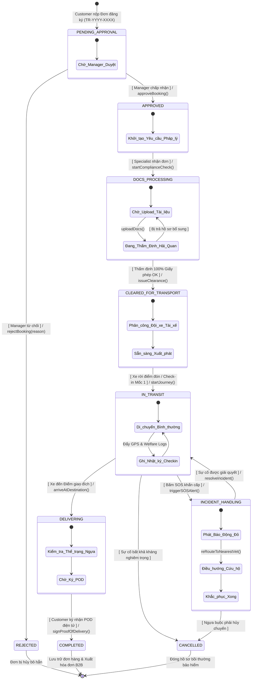
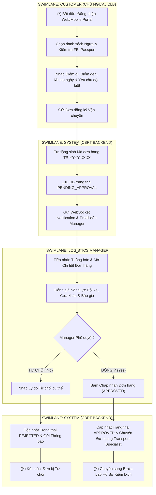
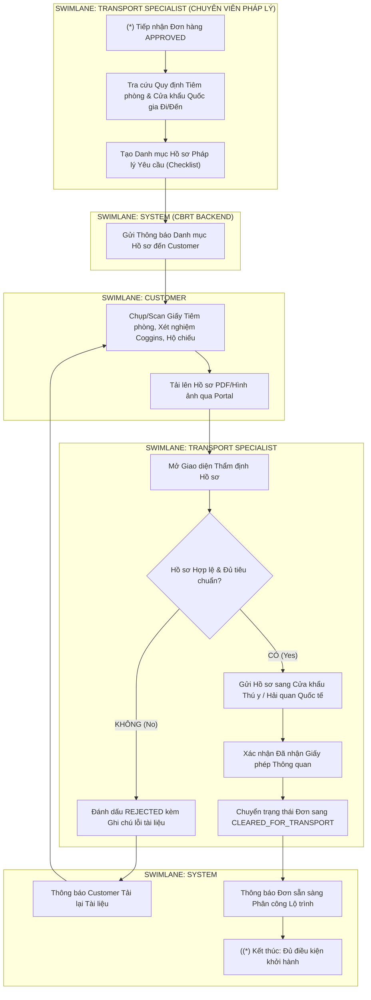
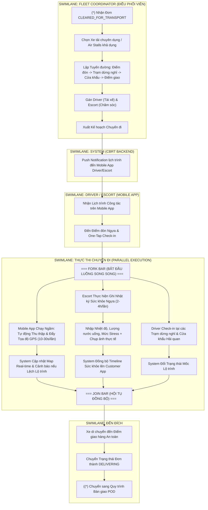
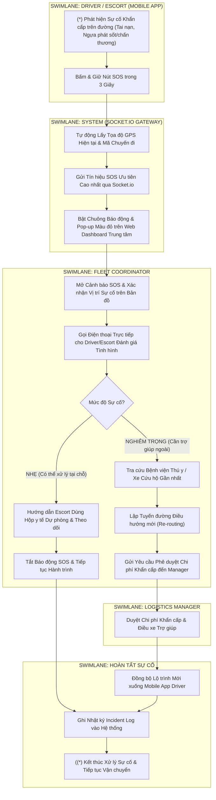
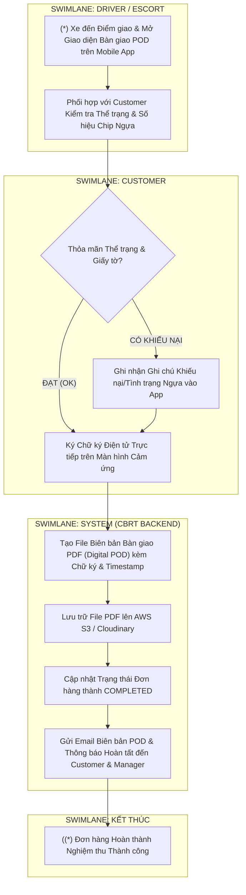
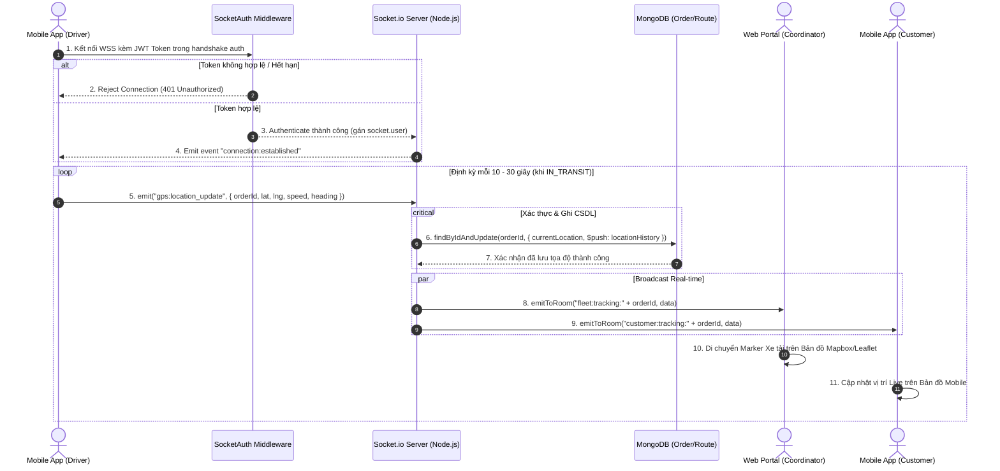
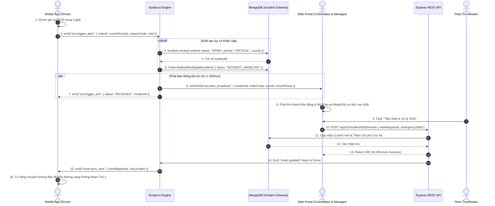

# TÀI LIỆU SƠ ĐỒ QUY TRÌNH CHUẨN UML 2.0 (UML 2.0 FLOW DIAGRAMS)
## DỰ ÁN: HỆ THỐNG QUẢN LÝ VẬN CHUYỂN NGỰA ĐUA XUYÊN QUỐC GIA (CBRT)

---

## MỤC LỤC
1. [Giới Thiệu Chuẩn Ký Hiệu UML 2.0](#1-giới-thiệu-chuẩn-ký-hiệu-uml-20)
2. [Sơ Đồ Use Case Tổng Thể (System Use Case Diagram)](#2-sơ-đồ-use-case-tổng-thể-system-use-case-diagram)
3. [Sơ Đồ Trạng Thái Vòng Đời Đơn Vận Chuyển (State Machine Diagram)](#3-sơ-đồ-trạng-thái-vòng-đời-đơn-vận-chuyển-state-machine-diagram)
4. [Sơ Đồ Hoạt Động Phân Vùng Swimlanes (Activity Diagrams with Swimlanes)](#4-sơ-đồ-hoạt-động-phân-vùng-swimlanes-activity-diagrams-with-swimlanes)
   - [Activity 4.1: Đặt Đơn & Phê Duyệt Vận Chuyển](#activity-41-đặt-đơn--phê-duyệt-vận-chuyển)
   - [Activity 4.2: Hồ Sơ Pháp Lý & Xin Giấy Phép Kiểm Dịch Cửa Khẩu](#activity-42-hồ-sơ-pháp-lý--xin-giấy-phép-kiểm-dịch-cửa-khẩu)
   - [Activity 4.3: Lập Lộ Trình, Phân Công & Thực Thi Chuyến Đi](#activity-43-lập-lộ-trình-phân-công--thực-thi-chuyến-đi)
   - [Activity 4.4: Xử Lý Sự Cố Khẩn Cấp SOS & Điều Hướng Lại](#activity-44-xử-lý-sự-cố-khẩn-cấp-sos--điều-hướng-lại)
   - [Activity 4.5: Nghiệm Thu Bàn Giao Điện Tử POD](#activity-45-nghiệm-thu-bàn-giao-điện-tử-pod)
5. [Sơ Đồ Tuần Tự Tương Tác Hệ Thống (Sequence Diagrams)](#5-sơ-đồ-tuần-tự-tương-tác-hệ-thống-sequence-diagrams)
   - [Sequence 5.1: Thu Nhập & Định Vị GPS Real-Time qua Socket.io](#sequence-51-thu-nhập--định-vị-gps-real-time-qua-socketio)
   - [Sequence 5.2: Phát & Xử Lý Tín Hiệu SOS Khẩn Cấp Real-Time](#sequence-52-phát--xử-lý-tín-hiệu-sos-khẩn-cấp-real-time)

---

## 1. GIỚI THIỆU CHUẨN KÝ HIỆU UML 2.0

Tài liệu này sử dụng chuẩn **UML 2.0** chính thức do Object Management Group (OMG) quy định:
- **Initial Node (`(*)`)**: Điểm bắt đầu luồng thực thi.
- **Activity Final Node (`((*)`)**: Điểm kết thúc toàn bộ quy trình.
- **Action State**: Hành động xử lý đơn lẻ do Actor hoặc Hệ thống thực hiện.
- **Decision / Merge Node (`<>`)**: Điểm rẽ nhánh điều kiện kèm theo **Guard Conditions `[Condition]`**.
- **Fork / Join Bar (`===`)**: Điểm phân nhánh song song (Fork) hoặc hội tụ đồng bộ (Join).
- **Swimlanes (Partitions)**: Phân vùng quy trình theo đối tượng Actor chịu trách nhiệm.

---

## 2. SƠ ĐỒ USE CASE TỔNG THỂ (SYSTEM USE CASE DIAGRAM)

Sơ đồ thể hiện toàn bộ các Actors và ranh giới hệ thống CBRT:

```mermaid
graph TB
  subgraph CBRT_SYSTEM ["HỆ THỐNG QUẢN LÝ VẬN CHUYỂN NGỰA ĐUA XUYÊN QUỐC GIA (CBRT)"]
    direction TB
    
    subgraph UC_AUTH ["Khối Authenticate & RBAC"]
      UC_Login["UC-01: Đăng nhập & Xác thực JWT"]
      UC_Profile["UC-02: Quản lý Thông tin Cá nhân"]
    end

    subgraph UC_BOOKING ["Khối Đơn Vận Chuyển"]
      UC_CreateOrder["UC-03: Đăng ký Đơn vận chuyển"]
      UC_ApproveOrder["UC-04: Phê duyệt Đơn hàng"]
      UC_RejectOrder["UC-05: Từ chối Đơn kèm Lý do"]
    end

    subgraph UC_COMPLIANCE ["Khối Kiểm Dịch & Pháp Lý"]
      UC_ManagePassport["UC-06: Số hóa Hộ chiếu FEI & Lý lịch Ngựa"]
      UC_UploadDocs["UC-07: Tải lên Hồ sơ Kiểm dịch"]
      UC_VerifyDocs["UC-08: Thẩm định Giấy phép Cửa khẩu"]
      UC_IssueClearance["UC-09: Cấp Giấy phép Thông quan"]
    end

    subgraph UC_DISPATCH ["Khối Điều Phối & Lộ Trình"]
      UC_ManageFleet["UC-10: Quản lý Xe tải & Air Stalls"]
      UC_CreateRoute["UC-11: Lập Tuyến đường & Waypoints"]
      UC_AssignCrew["UC-12: Phân công Driver & Escort"]
    end

    subgraph UC_REALTIME ["Khối Giám Sát & Sức Khỏe"]
      UC_GPSTracking["UC-13: Đẩy Tọa độ GPS Realtime"]
      UC_WelfareLog["UC-14: Nhập Nhật ký Sức khỏe Ngựa"]
      UC_CheckinWaypoint["UC-15: Check-in Mốc Điểm Dừng"]
      UC_LiveView["UC-16: Xem Live Tracking trên Bản đồ"]
    end

    subgraph UC_SOS ["Khối Quản Lý Sự Cố SOS"]
      UC_TriggerSOS["UC-17: Phát Tín hiệu SOS Khẩn cấp"]
      UC_ReceiveSOSAlert["UC-18: Tiếp nhận Cảnh báo SOS Đỏ"]
      UC_RerouteIncident["UC-19: Điều hướng Lộ trình Cứu hộ"]
      UC_ApproveEmergencyCost["UC-20: Duyệt Chi phí Phát sinh SOS"]
    end

    subgraph UC_POD ["Khối Bàn Giao & Báo Cáo"]
      UC_SignPOD["UC-21: Ký Bàn giao Điện tử POD"]
      UC_CompleteOrder["UC-22: Hoàn tất Đơn hàng & Xuất Biên bản"]
      UC_ViewAnalytics["UC-23: Xem Báo cáo KPI & Chỉ số OTD"]
    end
  end

  %% Actors Definition
  Customer(("Customer<br/>(Chủ Ngựa / CLB)"))
  Manager(("Logistics Manager<br/>(Quản Lý Điều Hành)"))
  Specialist(("Transport Specialist<br/>(Chuyên Viên Pháp Lý)"))
  Coordinator(("Fleet Coordinator<br/>(Điều Phối Viên)"))
  DriverEscort(("Driver / Escort<br/>(Tài Xế & Chăm Sóc)"))

  %% Customer Associations
  Customer --> UC_Login
  Customer --> UC_CreateOrder
  Customer --> UC_ManagePassport
  Customer --> UC_UploadDocs
  Customer --> UC_LiveView
  Customer --> UC_SignPOD

  %% Logistics Manager Associations
  Manager --> UC_Login
  Manager --> UC_ApproveOrder
  Manager --> UC_RejectOrder
  Manager --> UC_ApproveEmergencyCost
  Manager --> UC_ViewAnalytics

  %% Transport Specialist Associations
  Specialist --> UC_Login
  Specialist --> UC_VerifyDocs
  Specialist --> UC_IssueClearance

  %% Fleet Coordinator Associations
  Coordinator --> UC_Login
  Coordinator --> UC_ManageFleet
  Coordinator --> UC_CreateRoute
  Coordinator --> UC_AssignCrew
  Coordinator --> UC_ReceiveSOSAlert
  Coordinator --> UC_RerouteIncident

  %% Driver / Escort Associations
  DriverEscort --> UC_Login
  DriverEscort --> UC_GPSTracking
  DriverEscort --> UC_WelfareLog
  DriverEscort --> UC_CheckinWaypoint
  DriverEscort --> UC_TriggerSOS
  DriverEscort --> UC_SignPOD

  %% Include / Extend relationships
  UC_CreateOrder -.->|"<<include>>"| UC_ManagePassport
  UC_ApproveOrder -.->|"<<include>>"| UC_CreateRoute
  UC_RerouteIncident -.->|"<<extend>>"| UC_ApproveEmergencyCost
  UC_SignPOD -.->|"<<include>>"| UC_CompleteOrder
```

---

## 3. SƠ ĐỒ TRẠNG THÁI VÒNG ĐỜI ĐƠN VẬN CHUYỂN (STATE MACHINE DIAGRAM)

Sơ đồ State Machine thể hiện toàn bộ các trạng thái và điều kiện chuyển dịch của `Order` trong hệ thống:

---

## 4. SƠ ĐỒ HOẠT ĐỘNG PHÂN VÙNG SWIMLANES (ACTIVITY DIAGRAMS WITH SWIMLANES)

### Activity 4.1: Đặt Đơn & Phê Duyệt Vận Chuyển

---

### Activity 4.2: Hồ Sơ Pháp Lý & Xin Giấy Phép Kiểm Dịch Cửa Khẩu

---

### Activity 4.3: Lập Lộ Trình, Phân Công & Thực Thi Chuyến Đi

---

### Activity 4.4: Xử Lý Sự Cố Khẩn Cấp SOS & Điều Hướng Lại

---

### Activity 4.5: Nghiệm Thu Bàn Giao Điện Tử POD

---

## 5. SƠ ĐỒ TUẦN TỰ TƯƠNG TÁC HỆ THỐNG (SEQUENCE DIAGRAMS)

### Sequence 5.1: Thu Nhập & Định Vị GPS Real-Time qua Socket.io

Sơ đồ thể hiện luồng truyền tải dữ liệu tọa độ GPS từ thiết bị di động của Tài xế về Máy chủ và phát Real-time đến người dùng Web/Customer:

---

### Sequence 5.2: Phát & Xử Lý Tín Hiệu SOS Khẩn Cấp Real-Time

Sơ đồ mô tả chi tiết tương tác khi nút bấm SOS được kích hoạt:

---

## 6. BẢNG TỔNG HỢP MÃ LỖI & QUY TẮC CHUYỂN TRẠNG THÁI (GUARD CONDITIONS)

| Trạng Thái Đi (From) | Trạng Thái Đến (To) | Sự Kiện Kích Hoạt (Trigger Event) | Vai Trò Thực Hiện | Guard Conditions (Điều kiện Tiên quyết) |
| :--- | :--- | :--- | :--- | :--- |
| `PENDING_APPROVAL` | `APPROVED` | `approveBooking()` | Logistics Manager | Thông tin đơn hợp lệ; Báo giá tuyến đường được chấp thuận. |
| `PENDING_APPROVAL` | `REJECTED` | `rejectBooking(reason)` | Logistics Manager | Lý do từ chối không được để trống (`reason.length > 5`). |
| `APPROVED` | `DOCS_PROCESSING` | `startComplianceCheck()` | Transport Specialist | Hồ sơ hộ chiếu ngựa FEI đã được liên kết đầy đủ. |
| `DOCS_PROCESSING` | `CLEARED_FOR_TRANSPORT` | `issueClearance()` | Transport Specialist | 100% tài liệu kiểm dịch (Tiêm phòng, Coggins, Giấy phép) ở trạng thái `APPROVED`. |
| `CLEARED_FOR_TRANSPORT` | `IN_TRANSIT` | `startJourney()` / Check-in Mốc 1 | Driver / Escort | Đã phân công đủ Phương tiện (Vehicle), Driver và Escort khả dụng. |
| `IN_TRANSIT` | `INCIDENT_HANDLING` | `triggerSOSAlert()` | Driver / Escort | Tín hiệu SOS chứa tọa độ hợp lệ (`coordinates [lng, lat]`). |
| `INCIDENT_HANDLING` | `IN_TRANSIT` | `resolveIncident()` | Fleet Coordinator | Incident ghi nhận phương án giải quyết và được Manager phê duyệt nếu có chi phí. |
| `IN_TRANSIT` | `DELIVERING` | `arriveAtDestination()` | Driver / Escort | Tọa độ GPS xe trùng với bán kính 500m của Điểm giao đích. |
| `DELIVERING` | `COMPLETED` | `signProofOfDelivery()` | Customer | Chữ ký điện tử Base64 không được trống; Thể trạng ngựa được xác nhận. |

---
*Tài liệu Sơ đồ Quy trình chuẩn UML 2.0 này là căn cứ kiến trúc chính thức cho toàn bộ dự án CBRT-2026.*
